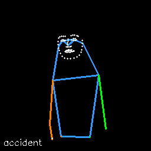

# 🧠 WholeBodyPose: A Unified End-to-End Framework for Sign Language Recognition and Pose-Based Training Data  

**Cristian Lazo-Quispe**, Renato Castro-Cruz, Mauricio Salazar-Espinosa, Gissella Bejarano  
*Universidad Nacional de Ingeniería · Pontificia Universidad Católica del Perú · Marist University*  
📄 *Published at [ICMV 2025](https://www.spie.org/conferences-and-exhibitions/international-conference-on-machine-vision) — “WholeBodyPose: A Unified End-to-End Framework for Sign Language Recognition and Pose-Based Training Data”*  

---

<div align="center">

[](https://huggingface.co/datasets/CristianLazoQuispe/ISLR_pose_datasets)
[](https://github.com/CristianLazoQuispe/WholebodyPoseEstimation)
[](https://www.docker.com/)
[](./LICENSE)

</div>

---

## 🌍 Overview

**WholeBodyPose** is an **open-source, modular, and standardized framework** for **pose-based Sign Language Recognition (SLR)**.  
It unifies **MediaPipe**, **RTMPose**, and **ViTPose** into a single interface under the **COCO-133 standard**, enabling reproducible preprocessing, filtering, and visualization of keypoints for both research and real-time applications.

The framework bridges the gap between heterogeneous pose estimation outputs, providing:
- ⚙️ Consistent preprocessing and filtering pipelines  
- 🧩 Unified COCO-133-compatible keypoint representation  
- 🎥 Real-time webcam inference and filtering with **NLMS smoothing**  
- 📊 Ready-to-train SLR pipelines using **Pose-TGCN**, **SPOTER**, **SILT**, and **GCN-BERT**

---

## 🔬 Key Contributions

| No. | Contribution | Description |
| :-: | :------------ | :----------- |
| 1 | **Unified API for Multiple Backends** | Seamless switching between MediaPipe, RTMPose, and ViTPose using a common interface (`model.predict(frame)` → COCO-133). |
| 2 | **COCO-133 Standardization** | Harmonized 133-keypoint structure (body, hands, face) + virtual chest/hip points for 135-keypoint mode. |
| 3 | **Real-Time NLMS Filtering** | Online temporal smoothing for keypoints using Normalized Least Mean Squares (no future frames required). |
| 4 | **Quality Control & Enhancement** | Built-in image enhancement (gamma/log correction, brightness normalization) for low-light robustness. |
| 5 | **Plug-and-Play ISLR Pipelines** | Ready-made Jupyter notebooks for **GCN-BERT**, **Pose-TGCN**, **SPOTER**, and **SILT** across multiple datasets. |

---

## 🧱 Repository Structure

```

WholebodyPoseEstimation/
├── codes/
│   ├── mediapipe/, rtmpose/, vitpose/   # Inference scripts (image/webcam)
│   ├── filtering/                       # NLMS and Kalman filtering demos
│   ├── islr_models/                     # ISLR model training pipelines
│   ├── drawing/                         # Visualization notebooks
│   └── comparison.py                    # Cross-model evaluation
├── src/wholebodypose/
│   ├── models/                          # Unified model wrappers
│   ├── filters/                         # Real-time filtering (NLMS, mean)
│   ├── enhancing/                       # Illumination correction
│   └── utils/                           # COCO133 utils, visualization
├── docker/                              # Dockerfiles & compose setups
├── data/                                # Example images/videos & metadata
├── results/                             # Demo outputs (GIFs, filtered poses)
├── requirements.txt
└── setup.py

````

---

## 🚀 Installation

### 1. Clone the repository
```bash
git clone https://github.com/CristianLazoQuispe/WholebodyPoseEstimation.git
cd WholebodyPoseEstimation
````

### 2. Install dependencies

```bash
pip install -r requirements.txt
```

### 3. (Optional) Docker setup

**CPU**

```bash
docker compose -f docker/docker-compose-cpu.yaml up
```

**GPU**

```bash
docker compose -f docker/docker-compose-gpu.yaml up
```

---

## 🧩 Usage

### ▶️ 1. Image or Video Inference

```bash
python -m src.wholebodypose.models.mediapipe.model --source path/to/video.mp4
```

or run:

```bash
jupyter notebook codes/mediapipe/inference_image.ipynb
```

### 🎥 2. Real-Time Webcam Inference with Filtering

```bash
jupyter notebook codes/filtering/inference_webcam_filters.ipynb
```

### 📚 3. Train Sign Language Recognition Models

Available training pipelines:

* **GCN-BERT**
* **Pose-TGCN**
* **SPOTER**
* **SILT**

Example:

```bash
cd codes/islr_models
jupyter notebook 3.TrainingGCN-BERT.ipynb
```
---

## 📊 Experimental Results (WACV-Style Summary)

**Dataset:** WLASL100
**Setup:** Training from scratch using only pose inputs (RTMPose-based 135 keypoints).

| Model     | Baseline Top-1 | With WholeBodyPose | Δ Accuracy |
| :-------- | :------------: | :----------------: | :--------: |
| Pose-TGCN |      55.43     |      **58.14**     |    +2.71   |
| GCN-BERT  |      60.15     |      **66.67**     |    +6.52   |
| SILT      |      62.79     |      **66.67**     |    +3.88   |
| SPOTER    |      63.18     |      **67.05**     |    +3.87   |

Standardized preprocessing yields consistent improvements across all models and datasets.

<p align="center">
  <br>
  <em>Example of real-time person keypoint tracking and filtering.</em>
</p>

---

## 🧠 Real-Time Filtering (NLMS)

**NLMS filtering** provides real-time denoising of pose keypoints using only past frames — ideal for live SLR and gesture-based interaction.

**Highlights**

* Adaptive learning per keypoint axis (x, y, confidence)
* Short-term memory fallback during occlusion
* Linear interpolation for uncertain detections
* Near-zero latency suitable for real-time deployment

---

## 🧰 Datasets

All processed and standardized pose datasets are publicly available on **Hugging Face**:

👉 **[ISLR Pose Datasets on HuggingFace 🤗](https://huggingface.co/datasets/CristianLazoQuispe/ISLR_pose_datasets)**

| Dataset           |  Classes | Keypoints | Type                      |
| :---------------- | :------: | :-------: | :------------------------ |
| WLASL100/300/2000 | 100–2000 |    135    | Word-level SLR            |
| MSASL100/200/1000 | 100–1000 |    135    | Word-level SLR            |
| ASL-Citizen       |   2731   |    135    | Community-Sourced         |
| LSA64             |    64    |    135    | Argentinian Sign Language |
| PUCP-DGI30        |    30    |    135    | Peruvian Sign Dataset     |

All keypoints follow **COCO-133 + 2 virtual landmarks (chest, mid-hip)**, extracted with RTMPose.

---

## 🧩 Citation

If you use this repository, please cite:

```bibtex
@inproceedings{lazo2025wholebodypose,
  title={WholeBodyPose: A Unified End-to-End Framework for Sign Language Recognition and Pose-Based Training Data},
  author={Lazo-Quispe, Cristian and Castro-Cruz, Renato and Salazar-Espinosa, Mauricio and Bejarano, Gissella},
  booktitle={International Conference on Machine Vision (ICMV)},
  year={2025},
  organization={SPIE}
}
```

---

## 📢 License

Released under the **MIT License**.
See [`LICENSE`](./LICENSE) for details.
